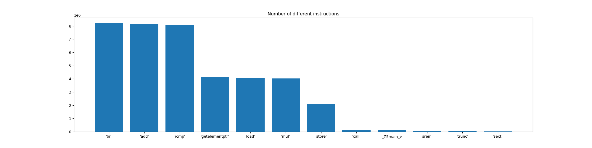

# Novoyaz language

## Atoms
Atoms is a simple simulations of something. Every atom moves to random direction by one Cell.
When the atoms crash into each other, they stick together, raising the temperature.
To run this do the following from your terminal:
```shell
cmake . -B build
cd build/
make run_Atoms
```
The result should be like above:


## main_ statistic:
In order to calculate statistic run it from the project dir:

```shell
python3 MyProfiler/compute_stat.py
```




